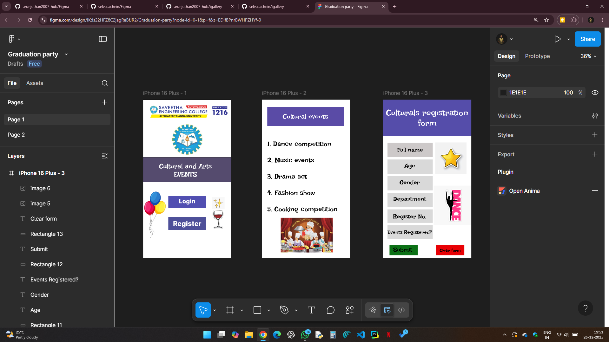

# Ex08 Event Registration Web Application
## Date: 26.12.2025

## AIM:
To design, develop and deploy a web application for event registration using Figma UI tool.

## UI DESIGN TOOL:
Figma

## DESIGN STEPS: 

### Step 1:
Use frames to represent screens or sections.

### Step 2:
Add column grids for consistent spacing and alignment.

### Step 3:
Insert shapes, text, buttons, and icons.

### Step 4:
Use Auto Layout for flexible, responsive design.

### Step 5:
Define color, text, and effect styles globally for consistency.

### Step 6:
Name layers logically and group related elements.

### Step 6:
Link frames to show navigation or interactions.

### Step 7:
Select the specific frame while generating code using Anima plugin.

## CODE:
1) Page-1
```
<!DOCTYPE html>
<html>
  <head>
    <meta name="viewport" content="width=device-width, initial-scale=1" />
    <meta charset="utf-8" />
    <link rel="stylesheet" href="globals.css" />
    <link rel="stylesheet" href="style.css" />
  </head>
  <body>
    <div class="iphone-plus">
      <div class="rectangle"></div>
      <div class="text-wrapper">Cultural and Arts EVENTS</div>
      
      
      <div class="div"></div>
      <div class="text-wrapper-2">Login</div>
      <div class="rectangle-2"></div>
      <div class="text-wrapper-3">Register</div>
      
      
    </div>
  </body>
</html>

@import url("https://cdnjs.cloudflare.com/ajax/libs/meyer-reset/2.0/reset.min.css");
* {
  -webkit-font-smoothing: antialiased;
  box-sizing: border-box;
}
html,
body {
  margin: 0px;
  height: 100%;
}
/* a blue color as a generic focus style */
button:focus-visible {
  outline: 2px solid #4a90e2 !important;
  outline: -webkit-focus-ring-color auto 5px !important;
}
a {
  text-decoration: none;
}

.iphone-plus {
  background-color: #ffffff;
  border: 1px solid;
  border-color: #000000;
  width: 100%;
  min-width: 519px;
  min-height: 932px;
  position: relative;
}

.iphone-plus .rectangle {
  position: absolute;
  top: 339px;
  left: 0;
  width: 519px;
  height: 146px;
  background-color: #554b6d;
  border: 1px solid;
  border-color: #000000;
}

.iphone-plus .text-wrapper {
  position: absolute;
  top: 365px;
  left: 33px;
  width: 434px;
  height: 101px;
  display: flex;
  align-items: center;
  justify-content: center;
  font-family: "Irish Grover-Regular", Helvetica;
  font-weight: 400;
  color: #ffffff;
  font-size: 40px;
  text-align: center;
  letter-spacing: 0;
  line-height: normal;
}

.iphone-plus .sec {
  position: absolute;
  top: 142px;
  left: 168px;
  width: 184px;
  height: 185px;
  aspect-ratio: 1;
  object-fit: cover;
}

.iphone-plus .logo {
  position: absolute;
  top: 6px;
  left: 0;
  width: 519px;
  height: 124px;
  aspect-ratio: 4.18;
  object-fit: cover;
}

.iphone-plus .div {
  position: absolute;
  top: 568px;
  left: 149px;
  width: 222px;
  height: 70px;
  background-color: #504fb0;
}

.iphone-plus .text-wrapper-2 {
  position: absolute;
  top: 574px;
  left: 199px;
  width: 121px;
  height: 46px;
  display: flex;
  align-items: center;
  justify-content: center;
  font-family: "Inter-ExtraBold", Helvetica;
  font-weight: 800;
  color: #ffffff;
  font-size: 35px;
  text-align: center;
  letter-spacing: 0;
  line-height: normal;
}

.iphone-plus .rectangle-2 {
  position: absolute;
  top: 690px;
  left: 149px;
  width: 222px;
  height: 77px;
  background-color: #4d5099;
}

.iphone-plus .text-wrapper-3 {
  position: absolute;
  top: 709px;
  left: 165px;
  width: 190px;
  height: 40px;
  display: flex;
  align-items: center;
  justify-content: center;
  font-family: "Inter-ExtraBold", Helvetica;
  font-weight: 800;
  color: #ffffff;
  font-size: 40px;
  text-align: center;
  letter-spacing: 0;
  line-height: normal;
  white-space: nowrap;
}

.iphone-plus .image {
  top: 535px;
  left: 0;
  width: 141px;
  height: 287px;
  aspect-ratio: 0.49;
  position: absolute;
  object-fit: cover;
}

.iphone-plus .img {
  top: 573px;
  left: 407px;
  width: 73px;
  height: 73px;
  aspect-ratio: 1;
  position: absolute;
  object-fit: cover;
}

```
2) Page-2
```
<!DOCTYPE html>
<html>
  <head>
    <meta name="viewport" content="width=device-width, initial-scale=1" />
    <meta charset="utf-8" />
    <link rel="stylesheet" href="globals.css" />
    <link rel="stylesheet" href="style.css" />
  </head>
  <body>
    <div class="iphone-plus">
      <div class="rectangle"></div>
      <div class="text-wrapper">Cultural events</div>
      <p class="element-dance-competition">
        1. Dance competition<br /><br />2. Music events<br /><br />3. Drama act<br /><br />4. Fashion show<br /><br />5.
        Cooking competition
      </p>
      
    </div>
  </body>
</html>

@import url("https://cdnjs.cloudflare.com/ajax/libs/meyer-reset/2.0/reset.min.css");
* {
  -webkit-font-smoothing: antialiased;
  box-sizing: border-box;
}
html,
body {
  margin: 0px;
  height: 100%;
}
/* a blue color as a generic focus style */
button:focus-visible {
  outline: 2px solid #4a90e2 !important;
  outline: -webkit-focus-ring-color auto 5px !important;
}
a {
  text-decoration: none;
}

.iphone-plus {
  background-color: #ffffff;
  width: 100%;
  min-width: 519px;
  min-height: 932px;
  position: relative;
}

.iphone-plus .rectangle {
  position: absolute;
  top: 42px;
  left: 32px;
  width: 450px;
  height: 113px;
  background-color: #5a4aa5;
}

.iphone-plus .text-wrapper {
  position: absolute;
  top: 75px;
  left: 123px;
  width: 267px;
  height: 48px;
  display: flex;
  align-items: center;
  justify-content: center;
  font-family: "Irish Grover-Regular", Helvetica;
  font-weight: 400;
  color: #ffffff;
  font-size: 40px;
  text-align: center;
  letter-spacing: 0;
  line-height: normal;
  white-space: nowrap;
}

.iphone-plus .element-dance-competition {
  position: absolute;
  top: 236px;
  left: 32px;
  width: 464px;
  height: 432px;
  display: flex;
  align-items: center;
  justify-content: center;
  font-family: "Irish Grover-Regular", Helvetica;
  font-weight: 400;
  color: #000000;
  font-size: 40px;
  letter-spacing: 0;
  line-height: normal;
}

.iphone-plus .image {
  position: absolute;
  top: 695px;
  left: 111px;
  width: 306px;
  height: 205px;
  aspect-ratio: 1.5;
  object-fit: cover;
}

```

3) Page-3
```
<!DOCTYPE html>
<html>
  <head>
    <meta name="viewport" content="width=device-width, initial-scale=1" />
    <meta charset="utf-8" />
    <link rel="stylesheet" href="globals.css" />
    <link rel="stylesheet" href="style.css" />
  </head>
  <body>
    <div class="iphone-plus">
      <div class="rectangle"></div>
      <div class="text-wrapper">Culturals registration form</div>
      <div class="div"></div>
      <div class="text-wrapper-2">Full name</div>
      <div class="rectangle-2"></div>
      <div class="rectangle-3"></div>
      <div class="rectangle-4"></div>
      <div class="text-wrapper-3">Department</div>
      <div class="rectangle-5"></div>
      <div class="text-wrapper-4">Register No.</div>
      <div class="rectangle-6"></div>
      <div class="text-wrapper-5">Age</div>
      <div class="text-wrapper-6">Gender</div>
      <div class="text-wrapper-7">Events Registered?</div>
      <div class="rectangle-7"></div>
      <div class="text-wrapper-8">Submit</div>
      <div class="rectangle-8"></div>
      <div class="text-wrapper-9">Clear form</div>
      
      
    </div>
  </body>
</html>

@import url("https://cdnjs.cloudflare.com/ajax/libs/meyer-reset/2.0/reset.min.css");
* {
  -webkit-font-smoothing: antialiased;
  box-sizing: border-box;
}
html,
body {
  margin: 0px;
  height: 100%;
}
/* a blue color as a generic focus style */
button:focus-visible {
  outline: 2px solid #4a90e2 !important;
  outline: -webkit-focus-ring-color auto 5px !important;
}
a {
  text-decoration: none;
}

.iphone-plus {
  background-color: #ffffff;
  width: 100%;
  min-width: 519px;
  min-height: 932px;
  position: relative;
}

.iphone-plus .rectangle {
  position: absolute;
  top: 0;
  left: 0;
  width: 519px;
  height: 212px;
  background-color: #544caa;
}

.iphone-plus .text-wrapper {
  position: absolute;
  top: 8px;
  left: 12px;
  width: 495px;
  height: 196px;
  display: flex;
  align-items: center;
  justify-content: center;
  font-family: "Irish Grover-Regular", Helvetica;
  font-weight: 400;
  color: #ffffff;
  font-size: 50px;
  text-align: center;
  letter-spacing: 0;
  line-height: normal;
}

.iphone-plus .div {
  position: absolute;
  top: 254px;
  left: 26px;
  width: 266px;
  height: 84px;
  background-color: #cdc9c9;
}

.iphone-plus .text-wrapper-2 {
  position: absolute;
  top: 264px;
  left: 34px;
  width: 250px;
  height: 63px;
  display: flex;
  align-items: center;
  justify-content: center;
  font-family: "Irish Grover-Regular", Helvetica;
  font-weight: 400;
  color: #000000;
  font-size: 35px;
  text-align: center;
  letter-spacing: 0;
  line-height: normal;
}

.iphone-plus .rectangle-2 {
  position: absolute;
  top: 352px;
  left: 26px;
  width: 266px;
  height: 84px;
  background-color: #d9d9d9;
}

.iphone-plus .rectangle-3 {
  position: absolute;
  top: 450px;
  left: 26px;
  width: 266px;
  height: 84px;
  background-color: #d9d9d9;
}

.iphone-plus .rectangle-4 {
  position: absolute;
  top: 548px;
  left: 26px;
  width: 266px;
  height: 84px;
  background-color: #d9d9d9;
}

.iphone-plus .text-wrapper-3 {
  position: absolute;
  top: 564px;
  left: 60px;
  height: 42px;
  display: flex;
  align-items: center;
  justify-content: center;
  font-family: "Irish Grover-Regular", Helvetica;
  font-weight: 400;
  color: #000000;
  font-size: 35px;
  text-align: center;
  letter-spacing: 0;
  line-height: normal;
  white-space: nowrap;
}

.iphone-plus .rectangle-5 {
  position: absolute;
  top: 646px;
  left: 26px;
  width: 266px;
  height: 79px;
  background-color: #d9d9d9;
}

.iphone-plus .text-wrapper-4 {
  position: absolute;
  top: 667px;
  left: 59px;
  height: 42px;
  display: flex;
  align-items: center;
  justify-content: center;
  font-family: "Irish Grover-Regular", Helvetica;
  font-weight: 400;
  color: #000000;
  font-size: 35px;
  text-align: center;
  letter-spacing: 0;
  line-height: normal;
  white-space: nowrap;
}

.iphone-plus .rectangle-6 {
  position: absolute;
  top: 739px;
  left: 26px;
  width: 266px;
  height: 82px;
  background-color: #d9d9d9;
}

.iphone-plus .text-wrapper-5 {
  position: absolute;
  top: 368px;
  left: 125px;
  height: 42px;
  display: flex;
  align-items: center;
  justify-content: center;
  font-family: "Irish Grover-Regular", Helvetica;
  font-weight: 400;
  color: #000000;
  font-size: 35px;
  text-align: center;
  letter-spacing: 0;
  line-height: normal;
  white-space: nowrap;
}

.iphone-plus .text-wrapper-6 {
  position: absolute;
  top: 466px;
  left: 97px;
  height: 42px;
  display: flex;
  align-items: center;
  justify-content: center;
  font-family: "Irish Grover-Regular", Helvetica;
  font-weight: 400;
  color: #000000;
  font-size: 35px;
  text-align: center;
  letter-spacing: 0;
  line-height: normal;
  white-space: nowrap;
}

.iphone-plus .text-wrapper-7 {
  position: absolute;
  top: 762px;
  left: 26px;
  height: 36px;
  display: flex;
  align-items: center;
  justify-content: center;
  font-family: "Irish Grover-Regular", Helvetica;
  font-weight: 400;
  color: #000000;
  font-size: 30px;
  text-align: center;
  letter-spacing: 0;
  line-height: normal;
  white-space: nowrap;
}

.iphone-plus .rectangle-7 {
  position: absolute;
  top: 856px;
  left: 38px;
  width: 166px;
  height: 60px;
  background-color: #0b7016;
}

.iphone-plus .text-wrapper-8 {
  position: absolute;
  top: 863px;
  left: 60px;
  height: 42px;
  display: flex;
  align-items: center;
  justify-content: center;
  font-family: "Irish Grover-Regular", Helvetica;
  font-weight: 400;
  color: #000000;
  font-size: 35px;
  text-align: center;
  letter-spacing: 0;
  line-height: normal;
  white-space: nowrap;
}

.iphone-plus .rectangle-8 {
  position: absolute;
  top: 856px;
  left: 311px;
  width: 167px;
  height: 60px;
  background-color: #e80105;
}

.iphone-plus .text-wrapper-9 {
  position: absolute;
  top: 874px;
  left: 294px;
  width: 202px;
  height: 26px;
  display: flex;
  align-items: center;
  justify-content: center;
  font-family: "Irish Grover-Regular", Helvetica;
  font-weight: 400;
  color: #000000;
  font-size: 25px;
  text-align: center;
  letter-spacing: 0;
  line-height: normal;
  white-space: nowrap;
}

.iphone-plus .image {
  top: 506px;
  left: 298px;
  width: 221px;
  height: 233px;
  position: absolute;
  aspect-ratio: 1;
  object-fit: cover;
}

.iphone-plus .img {
  top: 252px;
  left: 307px;
  width: 184px;
  height: 184px;
  position: absolute;
  aspect-ratio: 1;
  object-fit: cover;
}

```


## OUTPUT:


## RESULT:
The program to design, develop and deploy a web application for event registration using Figma UI tool is completed successfully.
